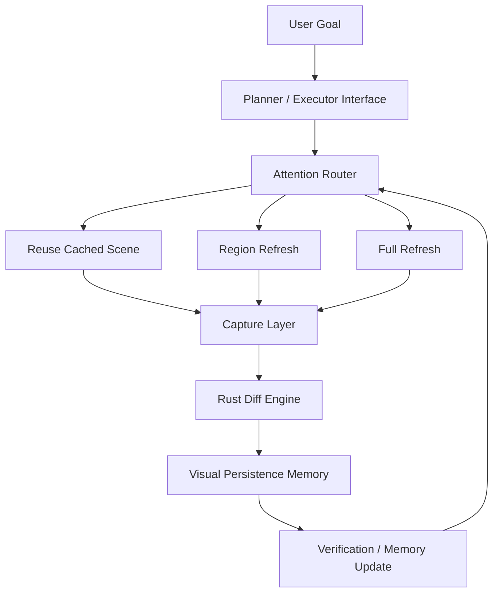
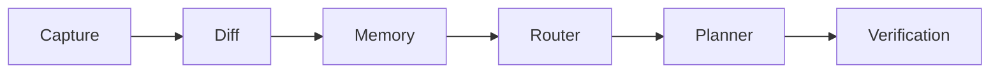
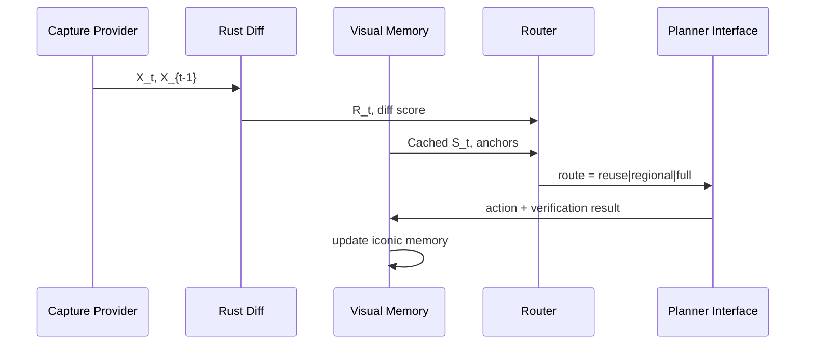

# Persistence Claw

**Stop re-seeing the same screen. Remember it.**

Persistence Claw introduces a neuroscience-inspired visual persistence layer for OpenClaw desktop agents. Instead of repeatedly sending full screenshots to LLMs, it maintains an iconic visual memory of the screen and performs delta-based updates, dramatically reducing token usage in desktop control workflows.

> **All rights reserved.** This repository is intentionally released without an open-source license.

## What Persistence Claw is

Persistence Claw is an OpenClaw-compatible middleware runtime that sits between desktop capture and agent planning. It keeps short-term visual working memory, detects scene deltas with a Rust engine, and selectively refreshes only the changed regions.

## Why desktop agents waste tokens

Many desktop agents re-send full-screen screenshots each step, even when 95% of pixels are unchanged. That pattern inflates multimodal token cost and latency.

## The core insight: iconic visual memory

Maintain a structured cached scene `S_t`, compute `D(X_t, X_{t-1})`, and route perception by relevance:

- **Reuse** cached state when changes are negligible.
- **Regional refresh** for localized deltas.
- **Full refresh** only when broad changes or failed verification demand it.

## Neuroscience motivation

Human perception relies on short-lived **iconic memory** and **selective visual updating** rather than full-scene reconstruction at each glance. Desktop agents can apply the same principle: preserve stable scene structure and spend perception budget only where task-relevant change occurs.

## Architecture overview





## Data flow



## Mathematical formulation

Let:

- `X_t`: frame at time `t`
- `S_t`: cached scene state
- `D(X_t, X_{t-1})`: diff operator
- `R_t`: changed regions
- `π(R_t, G_t, M_t) -> {reuse, regional_refresh, full_refresh}`: routing policy

Token objective:

- `C_total = Σ_t C_perception(t)`
- `C_naive = Σ_t C_full(X_t)`
- `C_pc = Σ_t [I_full(t) * C_full(X_t) + I_region(t) * C_region(R_t) + I_reuse(t) * C_reuse]`

Goal: minimize `C_pc` subject to maintaining task-success fidelity.

## Why TypeScript + Rust

- **TypeScript**: orchestration, SDK, router policies, memory APIs, benchmark harness.
- **Rust**: low-latency deterministic diff engine for high-frequency frame comparison.

## MVP features

- Typed scene and task memory model.
- Rust CLI diff engine with JSON output.
- TS bridge for robust subprocess integration.
- Configurable attention router with token-aware heuristics.
- File-based mock capture provider for reproducible experiments.
- Demo desktop-agent workflow with routing decisions and token estimates.
- Benchmark harness with sample report generation.

## Quickstart

```bash
pnpm install
cargo build --manifest-path native/vision-diff/Cargo.toml
pnpm demo
pnpm benchmark
pnpm test
```

## Repo structure

- `apps/demo-desktop-agent`: CLI demo workflow.
- `packages/*`: runtime modules, SDK, benchmark, shared types.
- `native/vision-diff`: Rust perceptual diff engine.
- `fixtures`: deterministic screenshot sequence + metadata.
- `docs`: generated benchmark report and architecture notes.

## Benchmark plan

Benchmark compares:

1. Naive full-screen re-analysis each step.
2. Persistence Claw routing with reuse + regional refresh.

Metrics:

- total estimated perception tokens
- reduction percentage
- full refresh count
- regional refresh count
- full-screen analyses avoided

## Roadmap

See [ROADMAP.md](ROADMAP.md) for near-term milestones and OpenClaw integration extension points.
